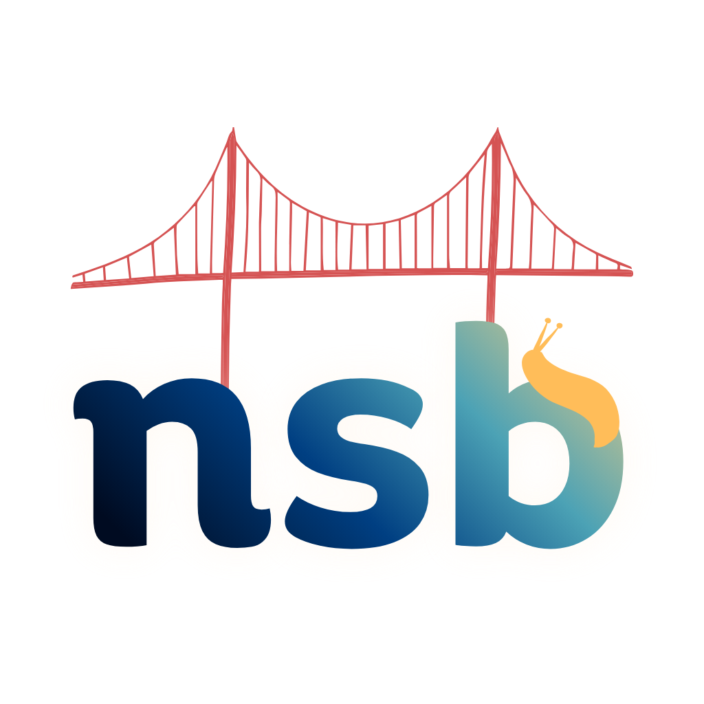

# **nsb** – the network simulation bridge

<table border="0">
  <tr>
    <td width="30%" valign="top">
      
    </td>
    <td width="70%">
      <em>This tool is in beta and your feedback is greatly appreciated.</em>
      <p>
        The Network Simulation Bridge, or NSB for short, a simple, low-overhead pipeline
        consisting of a message server and client interface libraries that bridge 
        together applications and network simulators. NSB is application-, network 
        simulator-, and platform-agnostic that allows developers to integrate any 
        application front-end with any network simulator back-end.
      </p>
      <p>
        For more information, or to cite NSB, you can access our 
        <a href="https://dl.acm.org/doi/10.1145/3616391.3622771">publication</a>.
      </p>
    </td>
  </tr>
</table>

## Installation

### Prerequisites

The following software packages are required to be installed:
* **CMake**, used to configure and build the project
* _**Pkg-Config**_, necessary in MacOS for package configuration
* **Redis**, whose server is used as a database to store payloads
* **Abseil**, necessary for Protobuf support and logging
* **Protobuf**, used to define and compile
* **YAML parsing**, to parse configuration files
* **hiredis**, to connect to the Redis server

Python API support involves additional package installation through its
[_requirements.txt_](python/requirements.txt) file and is detailed in the 
[Python README](python/README.md).

Platform-specific package install commands are provided below. Also, note that
previous installations of tools like _gRPC_ that include _protobuf_ may result
in conflicting versions for _protobuf_.

#### MacOS via Homebrew
```
brew install cmake pkg-config abseil protobuf yaml-cpp redis hiredis
```


### Build
__Cmake__ is used to build this project. In order to build the NSB components
(the NSB Daemon executable and the C++ and Python client libraries), create a 
_build_ (```mkdir build```) directory at the top level of this project 
directory, such that your directory now looks like this:

```
nsb/
├── build/
├── proto/
├── python/
├── cpp/
├── CMakeLists.txt
├── config.yaml
└── README.md
```

Then, enter the new _build_ directory (```cd build```) and start by configuring 
the _CMake_ build:
```cmake ..```

Within the output, you should see something like this:
```
[cmake] -- Checking target libraries:
[cmake] -- ✓ Found target: yaml-cpp::yaml-cpp
[cmake] -- ✓ Found target: protobuf::libprotobuf
[cmake] -- ✓ Found target: absl::base
[cmake] -- ✓ Found target: absl::log
[cmake] -- ✓ Found target: absl::time
[cmake] -- ✓ Found target: absl::log_internal_check_op
[cmake] -- ✓ Found target: absl::log_initialize
[cmake] -- ✓ Found target: PkgConfig::hiredis
```
If all the prerequisite software was installed, you may continue with building 
and installing NSB.
```
cmake --build . --clean-first
```
```
cmake --install .
```
The library, includes, and binary directories should now be available under
```[your/install/path]/nsb```. The install command will also make NSB available 
on _pkg-config_ as ```nsb```, which may be of use when compiling projects with 
NSB. The **NSB Daemon** executable used to run NSB can be found at 
```[your/install/path]/nsb/bin/nsb_daemon```.

### Uninstallation

Uninstallation of packages from your install path is simple. You can either:
* Delete the ```nsb``` directory from your install path to remove installed files
and delete ```lib/pkgconfig/nsb.pc``` from your install path to remove the 
_pkg-config_ index; or
* Delete all files listed in the install manifest within
the project ```build``` directory (```xargs rm < install_manifest.txt```).

Then, you may delete the ```build``` directory to remove the built project.

#### Windows via vcpkg
_Coming soon._

#### Linux

_Check the [Linux-specific instructions](linux-setup-guide.md)._

## Basic Usage

### Programming Interface

Currently, we support and provide interfaces for [Python](python/README.md) and 
[C++](cpp/README.md). These interfaces have a high level of feature parity, and
we aim to keep it that way. The language-specific READMEs contain more detail 
and the documents contain detailed API manuals.

The **NSB Daemon** serves as the bridge between the application space and the 
network simulator space and runs from its compiled binary. NSB provides two main
interfaces – the **NSB Application Client** (`NsbAppClient`) and the 
**NSB Simulator Client** (`NsbSimClient`) – two connect the bridge between 
the application and simulator, respectively.

In Python, the client interfaces are available via *nsb_client.py* which you 
must import. We recommend copying the contents of the [_python_](python/) 
directory, including the _proto_ folder, to your Python workspace.
```
import nsb_client as nsb
```
In C++, the installed _libnsb.dylib_ comes with two headers – _nsb.h_ and 
*nsb_client.h* – under the `nsb` namespace. Including *nsb_client.h* will give 
you access to the client interfaces while *nsb.h* will provide access to more 
general NSB logic.
```
#include "nsb.h"
#include "nsb_client.h"
```

#### Adding NSB in Projects

To integrate NSB into your projects, you may need to add NSB to your project 
and/or compile your project with NSB. To add NSB into your Python project, 
follow the [Python instructions](python/README.md). To compile your C++ project
with NSB, follow the [C++ instructions](cpp/README.md).

#### `NSBAppClient` Interface

The **NSB Application Client** provides an interface to your application and 
presents as a simplified version of traditional network interfaces. The 
application client can be created via its constructor. The `send` method sends a
payload to a target destination via NSB. The `receive` method receives incoming 
payloads via NSB. The `listen` method (not yet implemented in C++, sorry) is an 
asynchronous reception of incoming messages. 

In Python:
```
nsb_app = nsb.NSBAppClient("node0", "127.0.0.1", 65432)

...

# Send a payload.
outgoing_payload = b"Hello world!"
nsb_app.send("node1", payload)

...

# Receive a payload.
incoming_payload = nsb_app.receive() # Returns None if nothing was received.
if incoming_payload:
    # Process the incoming payload.
    ...

    # You can access the payload properties.
    print(f"Source: {incoming_payload.source}\n" + \
          f"Destination: {incoming_payload.destination}\n" + \
          f"Payload Size: {incoming_payload.payload_size}\n" + \
          f"Payload: {incoming_payload.payload}\n")

```
In C++:
```
...

const std::string client_id = "node0";
std::string daemon_address = "127.0.0.1";
int daemon_port = 65432;
nsb::NSBAppClient nsbApp = nsb::NSBAppClient(std::string("node0"), daemon_address, daemon_port);

// Send a payload.
std::string outgoing_payload = "Hello World!";
nsb_app.send(std::string("node1"), outgoing_payload);

...

// Receive a payload.
nsb::MessageEntry incoming_payload = nsbApp.receive()
if (incoming_payload.exists()) {
    // Process the incoming payload.
    ...

    // You can access the payload properties.
    std::cout << "Source: << incoming_payload.source\n" <<
          "Destination: << incoming_payload.destination\n" <<
          "Payload Size: << incoming_payload.payload_size\n" <<
          "Payload: << incoming_payload.payload\n" << std::endl;
}
```

#### `NSBSimClient` Interface

The **NSB Simulator Client** provides an interface to your network simulator 
that contains methods to fetch payloads to be routed through the simulated 
network and to post payloads when they have completed their journey through the
simulated network. The application client can be created via its constructor. 
The `fetch` method checks and fetches payloads that were sent and are to be 
transmitted over the simulated network. The `post` method is used when a payload
arrives at the destination node in the simulated network to allow the payload to
be received at the receiving application client.

In Python:
```
nsb_app = nsb.NSBSimClient("node0", "127.0.0.1", 65432)

...

# Fetch payload.
payload_to_transmit = nsb_app.fetch()
if payload_to_transmit: # Returns None if nothing was received.
    # You can access the payload properties.
    print(f"Source: {payload_to_transmit.source}\n" + \
          f"Destination: {payload_to_transmit.destination}\n" + \
          f"Payload Size: {payload_to_transmit.payload_size}\n" + \
          f"Payload: {payload_to_transmit.payload}\n")

    # Send over simulated network.
    ...

...

# Process the arrived payload from src_id to dest_id.
nsb_app.post(payload, src_id, dest_id)

```
In C++:
```
...

std::string daemon_address = "127.0.0.1";
int daemon_port = 65432;
nsb::NSBSimClient nsbApp = nsb::NSBSimClient(std::string("node0"), daemon_address, daemon_port);

// Fetch payload.
MessageEntry payloadToTransmit = nsbApp.fetch();
if (payloadToTransmit.exists()) {
    // You can access the payload properties.
    std::cout << "Source: << payloadToTransmit.source\n" <<
          "Destination: << payloadToTransmit.destination\n" <<
          "Payload Size: << payloadToTransmit.payload_size\n" <<
          "Payload: << payloadToTransmit.payload\n" << std::endl;
    // Send over simulated network.
    ...

}

...

// Process the arrived payload from src_id to dest_id.
nsb_app.post(payload, src_id, dest_id);
```

### System Configuration

The system configuration can be done within a YAML file. An example is provided 
in [_config.yaml_](config.yaml) for your convenience. We provide a few different
modes of operation.

The **system mode** (`system`→`mode`) can be set to either **PULL** (0) or 
**PUSH** (1) mode.
* In **PULL** mode, the NSB clients will poll the daemon server to fetch or 
receive messages. This is recommended for most configurations.
* In **PUSH** mode, the NSB daemon server will automatically forward sent and 
posted messages to the receiving clients, such that they can be readily received
or fetched without making a request to the server. This achieves better latency 
but may not work with all user device, program, and network configurations.

The **simulator mode** (`system`→`sim_mode`) can be set to either
**System-Wide** (0) or **Per-Node** (1) mode.
* In **System-Wide** mode, it is assumed that there will only be one simulator 
client and creating multiple simulator clients will not be allowed. The 
simulator client will fetch all payloads to be transmitted. This is good for 
top-down network simulator implementations like __ns-3__.
* In **Per-Node** mode, it is assumed that each node in your network will have a
respective simulator client. These simulator clients must have the same 
identifier as their co-related application client, so that when an 
`NSBAppClient` with identifier `"node0"` sends a payload, it will be fetched by 
its corresponding `NSBSimClient` with identifier `"node0"`, and vice-versa with 
posting and receiving payloads. This is good for bottom-up network simulator 
implementations like __OMNeT++__.

### Running Your System

These instructions assume you have already implemented the client-side APIs in
your code. Once this is complete, we recommend taking these steps in order:

1. **Start the Redis server.** Specify or take note of the port number that the
server is running on and make sure your configuration file points to the address
and port.
```redis-server -p 5050```

2. **Start the NSB Daemon.** If you followed the build instructions in above, 
then you can start the NSB Daemon executable from either the _build_ directory
or via install path, with that target configuration file: 
```
./build/nsb_daemon config.yaml
```
```
/[your/install/path]/nsb/bin/nsb_daemon config.yaml
```

3. **Start the modified network simulator.** In most cases, the simulator, 
modified using the _NSBSimClient_ API, should be started before the application
in order to be ready and listening for messages from the application space.

4. **Run your modified application.** Using the _NSBAppClient_ API, your 
application(s) should now be able to send messages via NSB over the simulated 
network.

## Extensibility
_Coming soon._

## _Acknowledgments_

We would like to thank the development team (all Ph.D., M.S., and undergraduate 
students, past and present) who have worked on this version and past versions of
NSB. We would also like to thank the Open Source Program Office (OSPO) in the 
Center for Research in Open Source Systems (CROSS) at the University of 
California, Santa Cruz, for their guidance in evolving NSB into an open-source
ecosystem.

## _License -- BSD_
Copyright 2026 UC Santa Cruz

Redistribution and use in source and binary forms, with or without modification, are permitted provided that the following conditions are met:

1. Redistributions of source code must retain the above copyright notice, this list of conditions and the following disclaimer.

2. Redistributions in binary form must reproduce the above copyright notice, this list of conditions and the following disclaimer in the documentation and/or other materials provided with the distribution.

3. Neither the name of the copyright holder nor the names of its contributors may be used to endorse or promote products derived from this software without specific prior written permission.

THIS SOFTWARE IS PROVIDED BY THE COPYRIGHT HOLDERS AND CONTRIBUTORS “AS IS” AND ANY EXPRESS OR IMPLIED WARRANTIES, INCLUDING, BUT NOT LIMITED TO, THE IMPLIED WARRANTIES OF MERCHANTABILITY AND FITNESS FOR A PARTICULAR PURPOSE ARE DISCLAIMED. IN NO EVENT SHALL THE COPYRIGHT HOLDER OR CONTRIBUTORS BE LIABLE FOR ANY DIRECT, INDIRECT, INCIDENTAL, SPECIAL, EXEMPLARY, OR CONSEQUENTIAL DAMAGES (INCLUDING, BUT NOT LIMITED TO, PROCUREMENT OF SUBSTITUTE GOODS OR SERVICES; LOSS OF USE, DATA, OR PROFITS; OR BUSINESS INTERRUPTION) HOWEVER CAUSED AND ON ANY THEORY OF LIABILITY, WHETHER IN CONTRACT, STRICT LIABILITY, OR TORT (INCLUDING NEGLIGENCE OR OTHERWISE) ARISING IN ANY WAY OUT OF THE USE OF THIS SOFTWARE, EVEN IF ADVISED OF THE POSSIBILITY OF SUCH DAMAGE.
